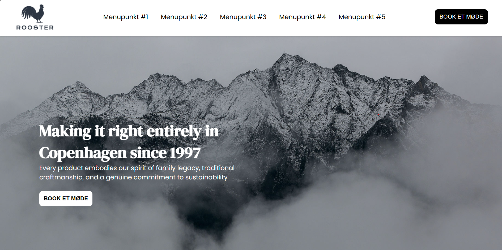

# Project Goal
This repository contains the HTML and CSS for my application at Standout Media and
the goal of the project is to design a front-page 1:1 according to the design-brief. 

# Project host
The project is hosted on [Vercel](https://standout-theta.vercel.app/)

# Result

### Key Sections:
- **Media Queries**:
 There are two main breakpoints - 1600px for the Hamburger Menu and 1200px for the 1D vertical columns on the sections
- **Header & Navigation**:  
  A sticky header with a logo, navigation menu, and a hamburger menu for mobile screens. The navigation links have `aria-labels` for accessibility.

- **Sections**:
  - **Section 1**: Hero section
  - **Section 2 & 3**: Content sections  with text and call-to-action buttons.
  - **Section 4**: Image grid layout for showcasing services or products.
  - **Section 5**: Another section with a two-column layout
  - **Section 6**: Message & Contact form

- **Footer**:  
  Footer with essential company details (e.g., address, phone number, email), social media links, and additional navigation links for information and services.

- **Interactive Elements**:  
  JS script tag at the bottom of the html for the hamburger menu that toggles the navigation on smaller screens.

